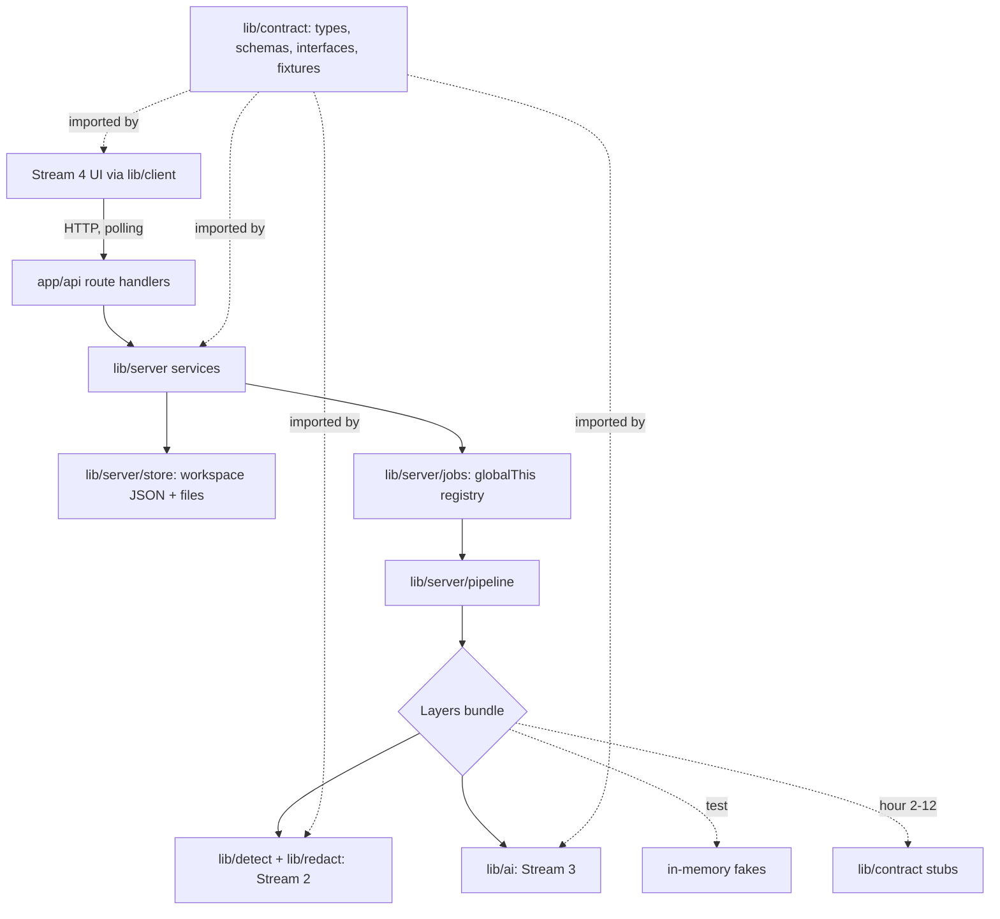
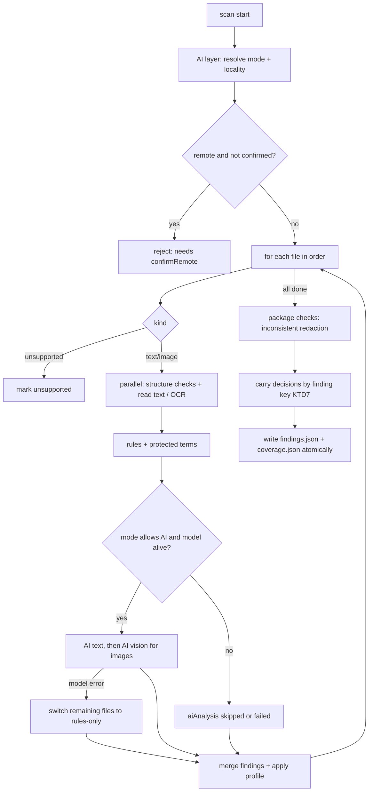
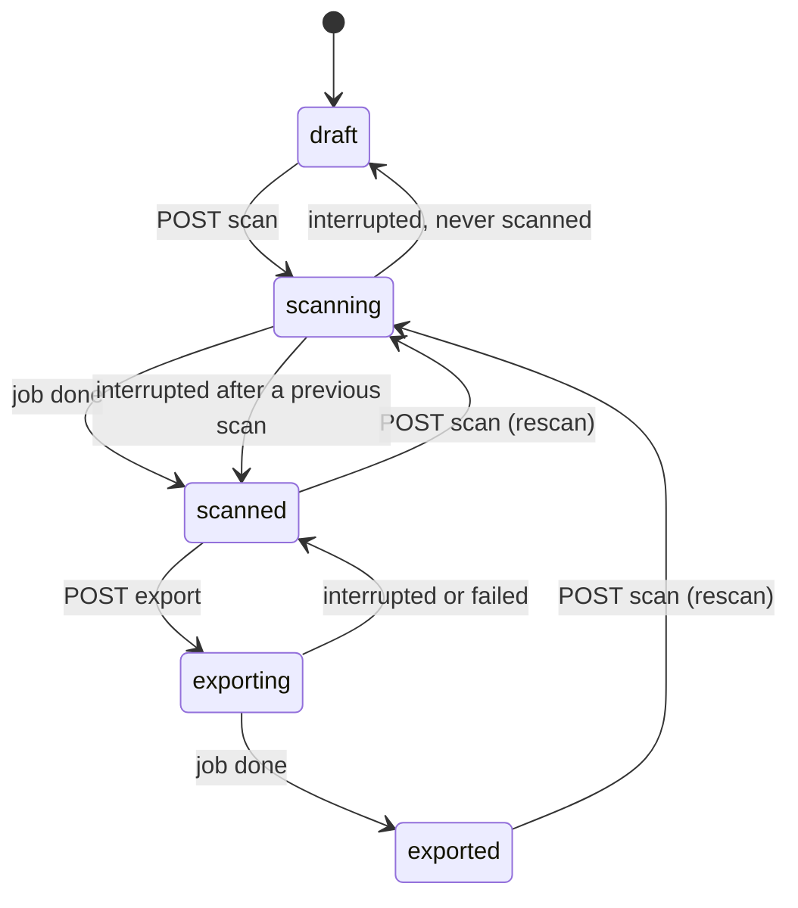

# Contract and Server Spine - Plan

## Goal Capsule

- **Objective:** The other three streams can build from hour 2 against one stable contract, and the server connects their work into one working scan, review, export, and verification flow on the user's machine.
- **Means:** A code-level contract in `lib/contract/` plus a server spine that receives the Detect, AI, and redaction layers as one injected bundle (KTD1, KTD2).
- **Owner:** Jed (Stream 1). Jed finishes and merges every unit to `main` per the team-split merge rules.
- **Product authority:** `sentineldesk-overview.md` sections 8, 10, 11, 14, 15, 16, 17. Coordination rules are in `docs/plans/2026-10-09-1558-docs-team-split-plan.md`. Detection, AI, and UI behavior belong to the other stream plans and are not active scope here. Where this plan and the overview disagree on product behavior, the Requirements below win; the overview wins on anything this plan does not state.
- **Execution profile:** Phase A (U1-U4) is time-boxed to hours 0-3 and blocks the team. Phase B (U5-U13) runs from hour 3 to Integration 1 at hour 12.
- **Stop conditions:** Stop and tell the team when spike F5 (U5) fails, when a contract change would break another stream's merged code (team-split R7), or when Phase A runs past hour 3.
- **Open blockers:** None. This stream is the first blocker for the others.

---

## Product Contract

### Summary

Stream 1 writes the contract first: shared types, zod schemas, the HTTP route list, and the module interfaces that Detect, AI, and the redactor implement. Then it builds the server spine: the workspace store, the job runner, the pipeline that calls each layer in order, the export and verification jobs, and all Route Handlers.

### Key Decisions

- **The contract is code, not a document.** It is TypeScript types plus zod schemas in `lib/contract/`. Every stream imports it, so the compiler finds a mismatch at once. Governs R1, R2.
- **Module interfaces are function signatures with stubs.** Each interface has a stub that returns fixture data. A stream that is not ready yet does not block the pipeline. Governs R3, R4.
- **Route Handlers only, polling for jobs.** See the team-split plan Key Decisions. Governs R5, R11.
- **Merge, de-duplication, and profile application are in Stream 2.** The pipeline calls them; it does not implement them. Governs R12.

<!-- ce-section: work-relationships -->
### How This Work Fits Together

This plan covers Stream 1 only. The other streams are in their own plans.

- Stream 2 (Detect): implements the detector, OCR, profile, merge, package-check, and redaction interfaces that this contract defines.
- Stream 3 (AI): implements the text analyzer, vision analyzer, connection test, locality, and mode interfaces.
- Stream 4 (UI): calls the HTTP API through a typed client and uses the fixture objects.

### Requirements

**Contract v1 (hour 0-2)**

- R1. `lib/contract/` holds every type in overview section 10 (Settings, Category, DetectionMethod, RecipientProfile, Recipient, AllowRule, Package, FileEntry, Evidence, Detection, Finding, ScanInfo, CoverageReport, Mode, Locality), plus an OCR word type (text, box, confidence, line index), a Job type (id, kind, status, progress per file, error), a package warning type (inconsistent redaction), and a related-occurrence result type.
- R2. Each API input and each persisted JSON file has a zod schema. API responses use one shared error shape.
- R3. The contract defines these module interfaces as typed function signatures, each with a stub that returns fixture data:
  - Detect: structure checks, rules, protected terms, OCR provider, profile application, finding merge, find-related (exact), inconsistent-redaction check.
  - AI: connection test, locality classification, mode resolution, text analysis, vision analysis, find-related (AI suggestions).
  - Redact: image redaction, text redaction.
- R4. The contract exports fixture objects for every main type, based on the demo package in overview section 3 (6 files, findings of each method, one failed file).
- R5. The contract includes the route table below, with the input and output type of each route.

| Method | Path | Purpose |
|---|---|---|
| GET / PUT | `/api/settings` | Read / save settings. The API key is never returned. |
| POST | `/api/settings/test` | Test connection: models, JSON test, latency, locality, mode preview |
| GET / POST | `/api/profiles` | List / create / update profiles |
| GET / POST | `/api/recipients` | List / create / update recipients |
| GET / POST | `/api/packages` | List / create packages |
| GET / DELETE | `/api/packages/[id]` | Package state, files, findings, coverage, warnings / delete package |
| POST | `/api/packages/[id]/files` | Upload files (multipart) |
| GET | `/api/packages/[id]/files/[fileId]` | Stream original file |
| GET | `/api/packages/[id]/files/[fileId]/ocr` | OCR words for the viewer |
| POST | `/api/packages/[id]/scan` | Start scan job |
| GET | `/api/packages/[id]/jobs/[jobId]` | Job progress (polled) |
| PATCH | `/api/packages/[id]/findings/[findingId]` | Decision: redact / keep / keep-and-remember / not-an-issue |
| POST | `/api/packages/[id]/regions` | Add / update / delete manual regions |
| POST | `/api/packages/[id]/related` | Find related occurrences of a term |
| PATCH | `/api/packages/[id]/files/[fileId]` | Exclude / include a file |
| POST | `/api/packages/[id]/export` | Start export + verification job |
| GET | `/api/packages/[id]/export.zip` | Download reviewed copies |
| GET | `/api/packages/[id]/reviewed/[fileId]` | Stream a reviewed file |

- R6. By hour 3, every route exists and returns fixture data (stub routes), so Stream 4 can build against real HTTP.

**Workspace store**

- R7. The store reads and writes the workspace layout in overview section 8 (`config.json`, `profiles.json`, `recipients.json`, `packages/<id>/...`, `cache/`, `models/`). `workspace/` is added to `.gitignore`.
- R8. Originals are stored by generated id under `original/` and are never written again. Uploaded file names are never used as paths. Export names are sanitized.
- R9. Upload enforces 25 MB per file and 50 files per package. Supported kinds follow M4; other files are stored as `unsupported` and listed in coverage.
- R10. Settings store non-secret values only. The API key comes only from `LLM_API_KEY` in env and never reaches `workspace/`, logs, or the browser. Logs contain ids and counts only, never file content or quotes.

**Jobs and pipeline**

- R11. Scan and export run as background jobs in the server process. The browser polls the job route. Job progress has a per-file status: queued / reading / OCR / rules / AI text / AI vision / done / failed (with reason).
- R12. The scan pipeline runs per file in the order of overview section 11, calling the Stream 2 and Stream 3 interfaces. Rules and structure checks can run in parallel. AI steps run one file at a time.
- R13. At scan start the pipeline gets mode and locality from the AI mode interface. If the model fails during a scan, the remaining files continue in Rules-only mode, and each file gets `aiAnalysis: "failed"`.
- R14. After all files, the pipeline runs the package checks (inconsistent redaction) and writes `findings.json` and `coverage.json`. Coverage follows overview section 16 and never shows a file as done when it has a problem.
- R15. A rescan keeps user decisions for findings that still match (same file, category, and evidence).
- R16. When the base URL locality is remote, scan start requires a per-package confirmation flag, unless `SENTINEL_ALLOW_REMOTE=true` in development.

**Decisions, regions, related**

- R17. A finding decision is saved at once. `keep-and-remember` adds an allow rule to the package's recipient in `recipients.json` (M14), except for category `secret`. `not-an-issue` is never remembered. See `docs/adr/0001-recipient-owns-allow-rules.md`.
- R18. A manual region becomes a finding with method `manual` and image-region evidence (M12).
- R19. The related route combines exact matches (Stream 2) and AI suggestions (Stream 3, Full and Text AI modes only) under one `relatedGroupId`. AI suggestions are marked as a separate group. One action can apply a decision to the full group (M13).

**Export and verification**

- R20. Export calls the Stream 2 redactors for each non-excluded file, writes `reviewed/` with the original names, and builds the zip. The review report is not in the zip.
- R21. After export, the server checks that the SHA-256 of each original is unchanged.
- R22. Verification runs the full pipeline on `reviewed/` (LLM cache is reused for unchanged content) and returns either the open findings or the text "Reviewed. No open detected findings." with the coverage summary (M16).
- R23. Inconsistent-redaction warnings appear before export. Export is still allowed after the user confirms.

**Run and spike**

- R24. Spike F5 (upload with `request.formData()`, file streaming, background job and polling, with `cacheComponents: true`) runs before the real routes are built. Read `node_modules/next/dist/docs/` first.
- R25. The production run binds to `127.0.0.1` (`next start -H 127.0.0.1`). All file routes use the Node.js runtime and are dynamic.

### Acceptance Examples

- AE1. **Covers R13.**
  - **Given:** a scan in Full mode with 6 files.
  - **When:** the model server stops after file 3.
  - **Then:** files 4-6 finish in Rules-only mode, each has `aiAnalysis: "failed"`, and coverage shows the mode change.
- AE2. **Covers R8, R21.**
  - **Given:** an uploaded file named `../../etc/passwd.txt`.
  - **When:** the file is stored and later exported.
  - **Then:** the original is at `original/<file-id>.txt`, the export name is sanitized, and the original hash is the same after export.
- AE3. **Covers R15.**
  - **Given:** the user marked a finding `keep` and then starts a rescan.
  - **When:** the rescan finds the same evidence again.
  - **Then:** the finding keeps the `keep` decision.
- AE4. **Covers R10.**
  - **Given:** `LLM_API_KEY` is set.
  - **When:** the UI calls `GET /api/settings`.
  - **Then:** the response contains no key value, only whether a key is set.

### Success Criteria

- Contract v1 is on `main` by hour 2 and stub routes by hour 3.
- Integration 1 (hour 12) passes: real Rules-only flow end to end on the demo package.
- Unit tests pass for the store path safety, coverage logic, decision carry-over on rescan, and the original-hash check.

### Scope Boundaries

- Detection logic, redaction drawing, LLM calls, and UI are other streams.
- No accounts, no multi-user, no telemetry, no desktop shell (overview section 6).
- No streaming job progress; polling only.

### Dependencies / Assumptions

- Streams 2 and 3 implement the interfaces in R3. Until they merge, the stubs keep the pipeline runnable.
- Next.js 16.4 Route Handlers support `request.formData()` for multipart upload; spike F5 confirms it.

---

## Planning Contract

**Product Contract preservation:** Product Contract unchanged, except the two brainstorm "Deferred to Planning" questions are removed because KTD5 (job storage across hot reload) and KTD7 (the "same evidence" rule in R15) now answer them.

### Key Technical Decisions

- KTD1. **The contract is TypeScript types derived from zod schemas, in `lib/contract/`.** Each persisted or transported type is a zod schema with its type inferred from it, so validation and types cannot drift. Pure domain unions with no input boundary (Category, DetectionMethod, Mode, Locality) are still schemas, so route input can reuse them. Use zod 4 (add in U1). Governs R1, R2.
- KTD2. **Layers are injected as one bundle, never imported directly by the pipeline.** The server builds a `Layers` bundle (Detect, AI, Redact functions from R3) at one wiring point. Stubs, real code, and test fakes are three bundles. The repo lint rule `noslop/no-module-mocking` bans module mocks, so injection is the only way to test the pipeline without real OCR or a model. Governs R3, R12.
- KTD3. **Stub routes are throwaway and live in the real route files.** At hour 3 each `app/api/**/route.ts` returns contract fixtures. Each Phase B unit replaces the stub body in the same file. URLs and response types never change, so Stream 4 needs no rewrite. Governs R6.
- KTD4. **The UI uploads one file per request.** `POST /api/packages/[id]/files` accepts a multipart body with exactly one file. Fifty files at 25 MB in one body would buffer more than 1 GB through `request.formData()`. Stream 4 sends files in sequence. Governs R9.
- KTD5. **Jobs live in an in-memory registry stored on `globalThis`.** A module-level map is reset by dev hot reload; a `globalThis` key survives it. A server restart loses running jobs. On read, a package with status `scanning` or `exporting` and no live job is reported as interrupted and goes back to its previous status, so the user can start again. Governs R11.
- KTD6. **Every GET handler calls `connection()` first.** With `cacheComponents: true`, Next.js 16.4 can prerender a GET Route Handler that reads no runtime data. File-backed GETs read async fs (which stops prerender), but an explicit `connection()` makes request-time execution a rule, not a side effect. Do not use the `dynamic` segment export; it is removed when Cache Components is on. Governs R25.
- KTD7. **"Same evidence" for decision carry-over is a stable finding key.** The key is file id + category + a normalized evidence fingerprint (text span start/end, or image box rounded to 4 px, or the structure byte offset). On rescan, a new finding whose key matches an old finding takes its decision. A finding whose key disappears is dropped. Governs R15.
- KTD8. **Settings precedence: saved config, then env, then built-in defaults.** `workspace/config.json` values (base URL, text model, vision model, timeout) replace the `LLM_*` env values. The API key is read only from `LLM_API_KEY`. `GET /api/settings` returns `apiKeySet: boolean`, never the key. Governs R10.
- KTD9. **Writes to workspace JSON are atomic.** Write to a temp file in the same folder, then rename. A crash during a write must not leave a half-written `findings.json`, because decisions are user work. Governs R7, R17.
- KTD10. **Zip with `jszip`.** It is pure JS (no native build on Windows), and the zip is built in memory from `reviewed/`, which is bounded by the upload limits in R9. Governs R20.
- KTD11. **The pipeline is a plain async function per job, not a queue library.** One job runs files in order. Inside a file, structure checks and rules run in parallel through `Promise.all`; AI steps await one at a time, and a package-level lock allows one scan or export job per package. Governs R12.

### High-Level Technical Design

Component boundaries. Arrows show calls. Only Stream 1 code calls the layers.



Scan pipeline per package (R12-R14). Directional; the layer order is from overview section 11.



Package status lifecycle (R11, KTD5).



Layers bundle, directional only (not the final signatures):

```text
Layers
  detect: structure(bytes, kind) · rules(text) · protectedTerms(text | ocrWords, terms)
          ocr(imageBytes) · applyProfile(findings, profile, recipient) · merge(findings)
          findRelatedExact(term, sources) · inconsistentRedactions(findings, terms)
  ai:     testConnection(settings) · classifyLocality(baseUrl) · resolveMode(settings)
          analyzeText(input) · analyzeVision(input) · findRelatedSuggestions(term, sources)
  redact: image(bytes, boxes, format) · text(content, spans, fileKind)
```

### Output Structure

```text
lib/
  contract/
    schemas.ts          # zod schemas + inferred types (R1, R2)
    interfaces.ts       # Layers bundle and layer function types (R3)
    stubs.ts            # stub Layers bundle backed by fixtures (R3)
    fixtures.ts         # demo-package fixture objects (R4)
    routes.ts           # route table: method, path, input, output types (R5)
    errors.ts           # shared API error type + helper (R2)
  server/
    paths.ts            # workspace paths, id-based file names, name sanitizing
    store.ts            # atomic JSON read/write, packages, originals, settings, profiles, recipients
    settings.ts         # precedence + env reading (KTD8)
    jobs.ts             # globalThis job registry + package lock (KTD5, KTD11)
    pipeline.ts         # scan pipeline (R12-R16)
    coverage.ts         # coverage report builder (R14)
    carry.ts            # finding key + decision carry-over (KTD7)
    export.ts           # export + hash check + zip (R20-R21)
    verify.ts           # verification run (R22)
    layers.ts           # the one wiring point that picks stubs or real layers (KTD2)
    *.test.ts           # colocated bun tests
app/api/**/route.ts     # one file per route in R5
```

### Assumptions

- `request.formData()` handles one 25 MB file in a Route Handler under Next.js 16.4. Spike F5 (U5) confirms it; on failure, the fallback in overview section 20 (Server Actions for upload) applies and the team is told.
- Streams 2 and 3 export real layer functions that match `lib/contract/interfaces.ts`, so `lib/server/layers.ts` switches from stubs to real code one layer at a time.

### Sequencing

Phase A (U1-U4) must merge by hour 3. U5 runs before any real route body. After U6, units U7, U8, U9 can go in any order; U10 needs U9; U11 needs U10; U12 needs U10 and U11; U13 is last.

---

## Implementation Units

| U-ID | Title | Key files | Depends on |
|---|---|---|---|
| U1 | Project setup | `package.json`, `.gitignore` | — |
| U2 | Contract schemas and types | `lib/contract/schemas.ts`, `lib/contract/errors.ts` | U1 |
| U3 | Layer interfaces, stubs, fixtures | `lib/contract/interfaces.ts`, `stubs.ts`, `fixtures.ts` | U2 |
| U4 | Route table and stub routes | `lib/contract/routes.ts`, `app/api/**/route.ts` | U3 |
| U5 | Spike F5 | throwaway spike route | U4 |
| U6 | Workspace store | `lib/server/paths.ts`, `store.ts`, `settings.ts` | U2, U5 |
| U7 | Settings, profiles, and recipients routes | `app/api/settings/**`, `app/api/profiles/route.ts`, `app/api/recipients/route.ts` | U6 |
| U8 | Packages, upload, files routes | `app/api/packages/**` (CRUD, files) | U6 |
| U9 | Job registry and job route | `lib/server/jobs.ts`, `.../jobs/[jobId]/route.ts` | U6 |
| U10 | Scan pipeline and coverage | `lib/server/pipeline.ts`, `coverage.ts`, `carry.ts`, `layers.ts` | U3, U9 |
| U11 | Decisions, regions, related, exclude | `.../findings/[findingId]`, `regions`, `related` routes | U10 |
| U12 | Export and verification | `lib/server/export.ts`, `verify.ts`, export routes | U10, U11 |
| U13 | Production run binding | `package.json` scripts | U12 |

### U1. Project setup

**Goal:** Add the shared dependencies and ignore rules that all streams need before contract work starts.

**Requirements:** R7, team-split R2, R3.

**Dependencies:** None.

**Files:**
- `package.json`, `bun.lock` (add `zod`, `jszip`)
- `.gitignore` (add `workspace/`)
- `.env.example` (the example from overview section 18, no real key)

**Approach:**
- Add only `zod` and `jszip`. Other streams add their own dependencies per team-split R3.
- `.env.example` is committed; `.env*` is already ignored, so add a `!.env.example` exception.

**Test expectation:** none -- dependency and config change only.

**Verification:** `bun install` succeeds on a clean clone; `git status` does not show a `workspace/` folder after a dev run.

### U2. Contract schemas and types

**Goal:** Every domain type in R1 exists as a zod schema with an inferred type, plus the shared API error type.

**Requirements:** R1, R2. KTD1.

**Dependencies:** U1.

**Files:**
- `lib/contract/schemas.ts`
- `lib/contract/errors.ts`
- `lib/contract/schemas.test.ts`

**Approach:**
- Mirror the field names of overview section 10 exactly, so other streams can read the overview as documentation.
- Add the types R1 names that the overview lacks: OCR word, Job (with per-file status from R11), package warning, related result, decision PATCH body, region body, scan start body (with `confirmRemote`), settings response (with `apiKeySet`), verification result (open findings, result text, coverage summary).
- Follow repo lint: no `Record<string, unknown>` (`noslop/no-unsafe-dictionary-type`), no `unknown` returns, no names that contain "shape" (`noslop/no-shape-in-symbol-names`).

**Patterns to follow:** colocated tests as in `tools/oxlint/noslop/rules/*.test.ts`.

**Test scenarios:**
- A Finding fixture with each Evidence variant parses.
- A Finding with `decision: "maybe"` is rejected.
- FileEntry with `aiAnalysis: "skipped-too-large"` parses.
- A settings response object with an extra `apiKey` field fails to parse (the schema is strict, so a key can never travel).
- Scan start body without `confirmRemote` defaults to `false`.

**Verification:** `bun test lib/contract` passes; `bun run lint` passes on `lib/contract/`.

### U3. Layer interfaces, stubs, fixtures

**Goal:** Streams 2 and 3 have exact function types to implement, and the pipeline can run end to end on stubs.

**Requirements:** R3, R4. KTD2.

**Dependencies:** U2.

**Files:**
- `lib/contract/interfaces.ts`
- `lib/contract/stubs.ts`
- `lib/contract/fixtures.ts`
- `lib/contract/stubs.test.ts`

**Approach:**
- One function type per item in R3, grouped into `Layers.detect`, `Layers.ai`, `Layers.redact` (see the High-Level Technical Design sketch).
- Inputs are named owner types, never broad `object` (`noslop/no-object-parameters`). Inputs carry bytes, text, and context, never file paths, so Stream 2 and 3 code stays free of I/O.
- Fixtures model the demo package in overview section 3: 6 files, one finding per detection method, `broken.png` failed, `spec.md` with no findings.
- Stubs return fixture findings keyed by file name, and the AI stub reports locality `mock`.

**Test scenarios:**
- Every fixture object parses with its schema from U2.
- The stub bundle satisfies the `Layers` type (compile-time) and its `detect.rules` returns the `.env.example` secret fixture for that file name.
- The stub `ai.resolveMode` returns mode `full` and locality `mock`.

**Verification:** Teammates can import `Layers` and fixtures from `main` by hour 2 (team-split R5).

### U4. Route table and stub routes

**Goal:** Every route in R5 exists and returns typed fixture data, so Stream 4 builds against real HTTP from hour 3.

**Requirements:** R5, R6. KTD3, KTD6.

**Dependencies:** U3.

**Files:**
- `lib/contract/routes.ts`
- `app/api/settings/route.ts`, `app/api/settings/test/route.ts`
- `app/api/profiles/route.ts`, `app/api/recipients/route.ts`
- `app/api/packages/route.ts`, `app/api/packages/[id]/route.ts`
- `app/api/packages/[id]/files/route.ts`, `app/api/packages/[id]/files/[fileId]/route.ts`, `app/api/packages/[id]/files/[fileId]/ocr/route.ts`
- `app/api/packages/[id]/scan/route.ts`, `app/api/packages/[id]/jobs/[jobId]/route.ts`
- `app/api/packages/[id]/findings/[findingId]/route.ts`, `app/api/packages/[id]/regions/route.ts`, `app/api/packages/[id]/related/route.ts`
- `app/api/packages/[id]/export/route.ts`, `app/api/packages/[id]/export.zip/route.ts`, `app/api/packages/[id]/reviewed/[fileId]/route.ts`

**Approach:**
- `routes.ts` lists method, path, input schema, and output type per route, so `lib/client/` (Stream 4) derives its types from one place.
- Use the generated `RouteContext<'/api/...'>` helper for dynamic params, per the bundled Route Handlers guide.
- The stub job route advances a fake job by elapsed time, so the UI can test polling and the rules-only banner.
- Read `node_modules/next/dist/docs/01-app/01-getting-started/15-route-handlers.md` before writing the first handler (AGENTS.md).

**Test expectation:** none -- throwaway stubs, replaced in U7-U12; checked by Stream 4 calls.

**Verification:** Each route answers with a body that parses against its output schema; `bun run build` passes.

### U5. Spike F5

**Goal:** Prove upload, file streaming, and background job + polling work in Next.js 16.4 with `cacheComponents: true` before real routes depend on them.

**Requirements:** R24.

**Dependencies:** U4.

**Files:**
- A throwaway route under `app/api/spike-f5/` (deleted at the end of the unit; folders that start with `_` are private and do not route)

**Approach:**
1. Upload one 25 MB file through `request.formData()` and write it to disk.
2. Stream it back with a `Response` over a file read stream.
3. Start a background promise that outlives the request, and poll its progress from a second route; confirm it survives a hot reload when stored on `globalThis` (KTD5).
4. Record results in the team chat; on failure, follow overview section 20 F5 fallback and stop per the Goal Capsule.

**Execution note:** This is a runtime smoke check; prefer running it in `bun run dev` and once in `bun run build && bun run start` over unit tests.

**Test expectation:** none -- spike; the code is deleted.

**Verification:** All four steps pass in dev and in a production build.

### U6. Workspace store

**Goal:** All server reads and writes of `workspace/` go through one module that enforces path safety, atomic writes, limits, and settings precedence.

**Requirements:** R7, R8, R9, R10. KTD8, KTD9.

**Dependencies:** U2, U5.

**Files:**
- `lib/server/paths.ts`, `lib/server/store.ts`, `lib/server/settings.ts`
- `lib/server/paths.test.ts`, `lib/server/store.test.ts`, `lib/server/settings.test.ts`

**Approach:**
- The workspace root comes from an env value with default `./workspace`, so tests point it at a temp folder.
- Originals are written once with read-only file mode; a second write to the same id is an error.
- Kind detection follows M4 by extension plus a magic-byte check for PNG/JPEG; a mismatch is stored as `unsupported` with a reason.
- Profiles are seeded from the Stream 2 presets on first read; until Stream 2 merges, seed from fixtures.
- Logging helpers accept ids and counts only (R10).

**Test scenarios:**
- Covers AE2. Storing `../../etc/passwd.txt` writes `original/<id>.txt` inside the package folder, and the sanitized export name contains no path separators.
- A 26 MB upload is rejected with the shared error type; the 51st file is rejected.
- A `.pdf` file is stored with kind `unsupported`.
- A `.png` extension on JPEG bytes is stored with kind `unsupported` and a reason.
- Writing `findings.json` while a reader reads it never yields a partial file (write then rename).
- Covers AE4. With `LLM_API_KEY` set, the settings read returns `apiKeySet: true` and no key value; `config.json` never contains the key after a save.
- Saved `baseUrl` in `config.json` wins over `LLM_BASE_URL`.
- Deleting a package removes its whole folder.

**Verification:** `bun test lib/server` passes; no store function accepts a raw upload name as a path.

### U7. Settings, profiles, and recipients routes

**Goal:** Replace the settings, profiles, and recipients stubs with real handlers backed by the store and the AI layer.

**Requirements:** R10, R17 (profile writes), M1 server side.

**Dependencies:** U6.

**Files:**
- `app/api/settings/route.ts`, `app/api/settings/test/route.ts`, `app/api/profiles/route.ts`, `app/api/recipients/route.ts`

**Approach:**
- `POST /api/settings/test` calls `Layers.ai.testConnection` with effective settings (KTD8) and returns its result plus `Layers.ai.resolveMode` as the mode preview.
- Profile and recipient create/update validate with the U2 schema and write atomically.

**Test scenarios:**
- Integration: with the stub AI layer, `POST /api/settings/test` returns locality `mock` and mode `full`.

**Verification:** Stream 4 Settings screen works against these routes at Integration 1.

### U8. Packages, upload, files routes

**Goal:** Real package CRUD, single-file upload, original streaming, OCR read, and file exclusion.

**Requirements:** R8, R9, R16 (confirmation flag stored per package), M2 server side. KTD4.

**Dependencies:** U6.

**Files:**
- `app/api/packages/route.ts`, `app/api/packages/[id]/route.ts`
- `app/api/packages/[id]/files/route.ts`, `app/api/packages/[id]/files/[fileId]/route.ts`, `app/api/packages/[id]/files/[fileId]/ocr/route.ts`

**Approach:**
- Upload rejects a body with zero or more than one file (KTD4).
- File streaming sets `Content-Type` from the stored mime and never from the upload name.
- `GET /api/packages/[id]` applies the interrupted-status rule from KTD5.
- `PATCH /api/packages/[id]/files/[fileId]` toggles `excluded`.

**Test scenarios:**
- Integration (bun test against the handler functions with a temp workspace): create package → upload 2 files → GET returns 2 FileEntries with sha256 and size.
- Upload with two files in one body returns a 400 error.
- GET of a package left in `scanning` with no live job returns its previous status and an interrupted flag.

**Verification:** Stream 4 New package screen uploads the 6 demo files one by one.

### U9. Job registry and job route

**Goal:** Background jobs with per-file progress that the browser polls.

**Requirements:** R11. KTD5, KTD11.

**Dependencies:** U6.

**Files:**
- `lib/server/jobs.ts`, `lib/server/jobs.test.ts`
- `app/api/packages/[id]/jobs/[jobId]/route.ts`

**Approach:**
- The registry key on `globalThis` is namespaced (for example `__sentineldesk_jobs`) and typed, with a safety comment on the one cast (`noslop/require-safety-comment-for-type-assertion`).
- Starting a second scan or export for a package that has a live job returns the existing job id.
- Finished jobs stay readable for the life of the process.

**Test scenarios:**
- A started job reports `queued`, then per-file statuses in order, then done.
- A job whose body throws ends as failed with the error message and the package lock is released.
- A second start for the same package while one runs returns the same job id.

**Verification:** Polling the job route shows progress for a stub-layer scan.

### U10. Scan pipeline and coverage

**Goal:** The real scan: layers called in order, mode fallback, profile and merge, package checks, decision carry-over, coverage.

**Requirements:** R12, R13, R14, R15, R16. KTD2, KTD7, KTD11.

**Dependencies:** U3, U9.

**Files:**
- `lib/server/pipeline.ts`, `lib/server/coverage.ts`, `lib/server/carry.ts`, `lib/server/layers.ts`
- `app/api/packages/[id]/scan/route.ts`
- `lib/server/pipeline.test.ts`, `lib/server/coverage.test.ts`, `lib/server/carry.test.ts`

**Approach:**
- `layers.ts` is the only file that imports `lib/detect`, `lib/ai`, `lib/redact`; it falls back to the stub for any layer not yet merged.
- OCR results are cached at `derived/<file-id>.ocr.json` and reused on rescan.
- The pipeline reads `LLM_PROVIDER` only through the AI layer; it has no mock logic of its own.
- Scan start with remote locality and `confirmRemote: false` returns an error unless `SENTINEL_ALLOW_REMOTE=true` and `NODE_ENV` is development (R16).

**Execution note:** Implement test-first with a fake Layers bundle; the pipeline order and fallback are the parts most likely to break silently.

**Test scenarios:**
- With fake layers, a 3-file package calls structure, OCR (images only), rules, protected terms, AI text, AI vision (images only) in that order per file.
- Covers AE1. Fake AI throws on file 4 of 6: files 4-6 have `aiAnalysis: "failed"`, finish in rules-only, and coverage records the mode change.
- Mode `text-ai` never calls AI vision.
- Mode `rules-only` never calls any AI function and each file has `aiAnalysis: "skipped-no-model"`.
- An unsupported file appears in `filesUnsupported` and never in `filesProcessed`.
- A failed file (OCR throws) appears in `filesFailed` with its reason and the other files still finish.
- Covers AE3. A finding marked `keep` keeps `keep` after rescan when its key matches; a finding with a moved box (beyond 4 px rounding) returns to `open`.
- Remote locality without confirmation is rejected; with the dev flag in development it proceeds.
- Coverage `findingsOpen` counts only `open` decisions; `llmQuotesDropped` sums the AI layer's counts.

**Verification:** Integration 1: Rules-only scan of `fixtures/demo-package/` through the real routes produces findings and correct coverage.

### U11. Decisions, regions, related, exclude

**Goal:** Users' review actions persist and package checks update.

**Requirements:** R17, R18, R19, R23 (warnings recomputed). M12, M13, M14 server side.

**Dependencies:** U10.

**Files:**
- `app/api/packages/[id]/findings/[findingId]/route.ts`, `app/api/packages/[id]/regions/route.ts`, `app/api/packages/[id]/related/route.ts`
- `lib/server/review.ts`, `lib/server/review.test.ts`

**Approach:**
- Each decision save re-runs `Layers.detect.inconsistentRedactions` and returns the updated warnings, so the banner is current without a full reload.
- `keep-and-remember` writes the allow rule to the package's recipient (category + quote text). For category `secret` it saves the `keep-and-remember` decision but writes no allow rule.
- A group decision applies to every finding with the same `relatedGroupId`.
- Related AI suggestions are requested only in modes `full` and `text-ai`.

**Test scenarios:**
- `keep-and-remember` on a `personal-contact` finding adds one allow rule to the recipient; a second identical call adds none.
- `keep-and-remember` on a `secret` finding adds no allow rule.
- An allow rule on recipient A does not change the suggested action in a package for recipient B with the same profile.
- An occurrence marked `not-an-issue` does not cause an inconsistent redaction warning.
- A manual region creates a finding with one detection of method `manual`, category `other` unless the body names one, and image-region evidence.
- Deleting a manual region removes its finding.
- Redacting "Juniper" in one file while another occurrence is `open` returns one warning naming both files.
- Related in `rules-only` mode returns exact matches only and no AI group.

**Verification:** Stream 4 Review screen actions persist across a page reload.

### U12. Export and verification

**Goal:** Reviewed copies are written, originals are proven unchanged, and verification reports the result in the required words.

**Requirements:** R20, R21, R22, R23. KTD10.

**Dependencies:** U10, U11.

**Files:**
- `lib/server/export.ts`, `lib/server/verify.ts`
- `app/api/packages/[id]/export/route.ts`, `app/api/packages/[id]/export.zip/route.ts`, `app/api/packages/[id]/reviewed/[fileId]/route.ts`
- `lib/server/export.test.ts`, `lib/server/verify.test.ts`

**Approach:**
- Export start requires `confirmWarnings: true` in the body when warnings exist (R23).
- `reviewed/` is cleared before each export, so an excluded file from a previous export does not stay.
- Verification reuses the U10 pipeline over `reviewed/` with the same Layers bundle, then compares; the LLM cache in Stream 3 makes unchanged files cheap.
- The result text "Reviewed. No open detected findings." lives in one constant in `lib/contract/` so the UI and the server cannot drift.
- The verification result is saved to `packages/<id>/verification.json` and returned by `GET /api/packages/[id]`, so the report survives a page reload or a finished job leaving memory.
- A `redact` finding whose only evidence is `image-whole` has no box to fill. Export rejects with the list of such findings until the user draws a box (M9, M12) or changes the decision. `file-structure` evidence needs no box, because the rebuild in Stream 2 removes metadata and trailing data.

**Test scenarios:**
- Covers AE2. After export, every original's SHA-256 equals its stored value; a changed original fails the export with an error that names the file id.
- An excluded file is not in `reviewed/` and not in the zip.
- The zip contains no review report file.
- Export with open warnings and no `confirmWarnings` is rejected.
- With fake layers that find nothing on `reviewed/`, the result is the exact required text; with one finding, the result lists it.
- A `redact` finding with only `image-whole` evidence makes export fail and names that finding; after a manual box is added, export proceeds.
- After export, `GET /api/packages/[id]` returns the saved verification result.

**Verification:** Integration 1: export of the demo package downloads a zip, and verification reports a result.

### U13. Production run binding

**Goal:** The production run listens only on `127.0.0.1`.

**Requirements:** R25.

**Dependencies:** U12.

**Files:**
- `package.json` (`start` script)

**Approach:** Change `start` to bind to `127.0.0.1`. Keep `dev` as is.

**Test expectation:** none -- script change; verified by a smoke check.

**Verification:** After `bun run build && bun run start`, the app answers on `http://127.0.0.1:3000` and not on the machine's LAN IP.

---

## System-Wide Impact

- **Every stream imports `lib/contract/`.** A breaking change there breaks three branches at once; team-split R6 and R7 govern changes.
- **Stream 4 must upload one file per request** (KTD4) and must show the interrupted status (KTD5).
- **Streams 2 and 3 must keep their code free of file and network I/O beyond what R3 allows,** because `lib/server/layers.ts` is the only wiring point (KTD2).

## Risks & Dependencies

| Risk | Mitigation |
|---|---|
| Phase A runs late and blocks three people | U2-U4 scope is fixed; extras go in later additive commits (team-split R7). Stop condition in the Goal Capsule. |
| Spike F5 fails on upload or background work | Stop and tell the team; fall back per overview section 20 before U8. |
| Real layers land late, so Integration 1 runs on stubs | `layers.ts` falls back per layer; Integration 1 still proves the server path. |
| Hot reload or restart loses a running job | KTD5 interrupted rule; the user rescans. |

---

## Verification Contract

| Gate | Command | Applies to |
|---|---|---|
| Unit tests | `bun test` | U2, U3, U6, U8-U12 |
| Lint | `bun run lint` | all units |
| Type check and build | `bun run build` | U4 onward |
| Runtime smoke | `bun run dev`, then the demo package through upload, scan, review, export | U5, U10-U12 |
| Production bind | `bun run build && bun run start` | U13 |

## Definition of Done

- Contract v1 (U1-U3) is on `main` by hour 2 and stub routes (U4) by hour 3.
- All units are merged; `bun test`, `bun run lint`, and `bun run build` pass on `main`.
- Integration 1 passes: the demo package goes through upload, Rules-only scan, review, export, and verification through real routes.
- The spike route from U5 and any other abandoned-attempt code is removed from the diff.
- No log line, API response, or workspace file contains the API key, file content, or quotes (R10).
