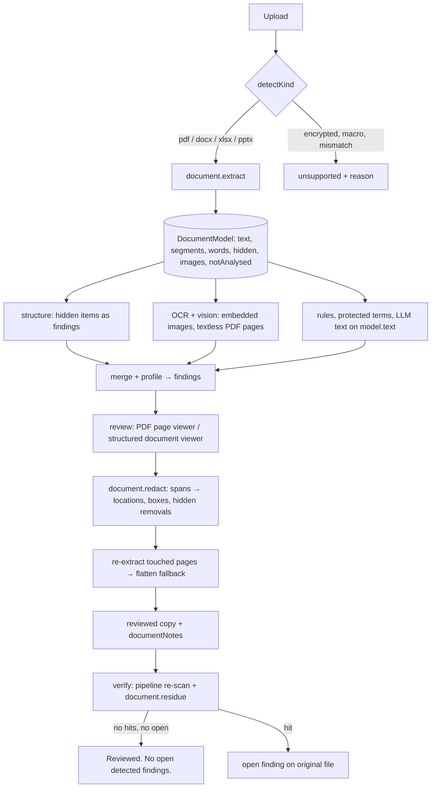

# Document Formats (PDF, DOCX, XLSX, PPTX) - Plan

## Goal Capsule

- **Objective:** A user can put PDF, DOCX, XLSX, and PPTX files in a package, review what they reveal to the recipient, and export reviewed copies that are still working documents with the approved content removed, and that pass verification.
- **Product authority:** `PRODUCT.md` and `sentineldesk-overview.md`, as amended by R1 of this plan. Glossary terms come from `CONTEXT.md`.
- **Means:** a new `lib/document/` layer that turns each document into one analysable text with a location map, so the existing detection layers run unchanged, plus per-format redactors and an independent residue check (KTD1, KTD2, KTD6).
- **Open blockers:** none. The product-scope change (R1) lands in U1, before any code, so judges and teammates never read a contradicting `PRODUCT.md`.
- **Stop conditions:** stop and ask if MuPDF.js cannot run inside a Next.js 16 Route Handler with the network off (U4 spike), or if a planned change would weaken an existing image or text behavior or test.
- **Execution profile:** sequential units in dependency order. U3 and U4 can run in parallel after U2. U10 can start once U9's routes exist.
- **Finishes and ships:** the implementer runs every unit and the Verification Contract, then opens one PR from `feat/add-more-types`.
- **Product Contract preservation:** changed R18 and R19, confirmed by the user in the planning synthesis. R18: an Office object that can't be rendered locally is removed and replaced with a placeholder, not flattened to pixels. R19: flatten notes appear before download, not before export, because they are only known once export runs. The resolved deferred questions were removed and are answered by KTD3, KTD5, KTD7 and KTD9.

---

## Product Contract

### Summary

Cloak adds four document kinds: PDF, DOCX, XLSX, and PPTX. Each one goes through the same detection layers as text and images. Hidden content becomes a finding. Export removes approved content from the document itself, not just from what is visible. When removal of a region cannot be verified, Cloak flattens only that page or object to pixels and says so in coverage.

### Problem Frame

Freelancer handoffs are mostly proposals, SOWs, pricing sheets, and decks, not screenshots. Today Cloak lists these files as "not supported". The user still has to send them without review, and those files are where "other clients", internal pricing, and tracked-change author names leak. The original scope left these formats out because PDF redaction tools routinely leak text through glyph positions (overview §154). This plan takes them on, and makes verification strict enough that the success copy stays true.

### Key Decisions

- **Native redaction, not inspection-only.** The reviewed copy stays an editable document, which overturns the "out of scope" line in `PRODUCT.md`. (session-settled: user-directed — chosen over inspect-only S8, flatten-whole-file, and text-extraction-only: recipients need working documents.) Governs R1, R11–R17.
- **All four formats in one plan.** (session-settled: user-directed — chosen over one-format-first, DOCX recommended: one coherent "documents" capability.) Each format still has its own acceptance examples, so no format's verification is weakened to match the others. Governs R2.
- **Unverifiable regions flatten locally, not whole-file.** (session-settled: user-approved — chosen over blocking export and flattening the whole file: keeps the rest of the document native while staying honest.) Governs R18, R19.
- **Hidden content is findings, default remove.** (session-settled: user-approved — chosen over silent strip and split policy: matches the existing structure-check layer, and the user can keep things they meant to send.) Governs R7–R10.
- **PDF previews as rendered pages, Office as a structured view.** (session-settled: user-approved — chosen over LibreOffice rendering and text-only: no heavy local install, and PDF keeps visual context and manual boxes.) Governs R21–R23.
- **Legacy binary Office (`.doc`/`.xls`/`.ppt`) and ODF stay unsupported.** (session-settled: user-directed — only PPTX added to the three named formats.)

### Requirements

**Product scope**

- R1. `PRODUCT.md` (Capabilities → Inputs, Out of scope, Positioning) and `sentineldesk-overview.md` (out-of-scope list, S8) are updated to say Cloak inspects and natively redacts PDF, DOCX, XLSX, and PPTX. "Does not compete on PDF/Office PII redaction" is reworded to recipient-aware review rather than removed silently.
- R2. Supported document kinds are PDF, DOCX, XLSX, and PPTX, recognised by extension plus a content check. A mismatch between name and content, an encrypted or password-protected file, or a macro-enabled variant (`.docm`, `.xlsm`, `.pptm`) is stored as unsupported with a specific reason.

**Inspection**

- R3. All text the recipient could reach is analysed by the rules, protected-term, and LLM layers, with exact-quote evidence that points to a location: PDF page, DOCX paragraph or table cell, XLSX sheet and cell, PPTX slide and shape.
- R4. XLSX analysis covers cell values, and also formula text and cached results, because a formula can name another sheet or workbook.
- R5. PPTX analysis covers slide text, speaker notes, and slide-layout or master text.
- R6. Embedded images in any document, and PDF pages that have no extractable text layer, go through the existing OCR and vision layers, with findings attributed back to their page or object.
- R7. Hidden content produces a structure finding with evidence. This includes comments, tracked changes (with author names), hidden sheets/rows/columns, white or zero-size or off-page text, document properties and XMP metadata, PDF annotations, form-field values, attachments, and embedded files.
- R8. External links and references (linked workbooks, remote images, hyperlinks to internal hosts) produce a finding, because the target name can reveal a client or system.
- R9. The suggested action for every hidden-content finding (R7, R8) is remove. The user can still choose keep, keep and remember, or not an issue, under the existing decision rules.
- R10. Content Cloak cannot parse inside a supported file, such as SmartArt, OLE objects, charts, or macros, is listed in that file's coverage as "not analysed" with a reason, and is never skipped silently.

**Reviewed copies**

- R11. Originals stay read-only. Each reviewed copy is a new file of the same format that opens in mainstream viewers (Acrobat/Preview, Word, Excel, PowerPoint, LibreOffice).
- R12. A redaction removes the underlying content, not just what is visible. No redacted string survives in text extraction, copy/paste, search, XML parts, content streams, glyph positions, fonts' `ToUnicode` maps, or undo/revision data.
- R13. In PDFs, a redacted text region is removed from the page content and replaced with a solid fill at the same bounds. A manual box removes all text and image content under it.
- R14. In DOCX and PPTX, redacted text is replaced with a fixed-width placeholder that keeps the layout roughly in place. A redacted embedded image is rebuilt through the existing image redactor.
- R15. In XLSX, a redacted cell has its value, formula, and cached result cleared and replaced with the placeholder. Formulas elsewhere that referenced the cell are flagged in coverage, not rewritten.
- R16. Removing hidden content (R7) deletes it from the file: comments, accepted-away revisions (tracked changes are resolved to the visible text), hidden sheets, properties, annotations, attachments.
- R17. Every reviewed copy has document properties and XMP metadata stripped, regardless of findings, matching image export today.

**Fallback and verification**

- R18. When Cloak cannot verify that a native redaction removed the content, it flattens only the affected PDF page or embedded image to pixels, applies the solid fill there, and keeps the rest of the document native. An Office object Cloak cannot render locally (chart, SmartArt, OLE) is removed and replaced with a labelled placeholder instead.
- R19. Coverage names each flattened page, removed object, and the reason. Scan-time notes (not analysed, signature dropped) show before export, and export-time notes (flattened, removed) show in the export summary before the user downloads the reviewed copies.
- R20. Verification re-opens each reviewed copy with an independent extraction path, re-runs detection, and confirms that no approved-redacted string or removed hidden item is still there. A failure blocks the success copy for that file.

**Review surface**

- R21. A PDF previews as page images, with finding boxes and manual boxes, using the existing image-viewer behavior.
- R22. DOCX, XLSX, and PPTX preview in a structured view: paragraphs and tables, a sheet grid with sheet tabs (hidden sheets marked), and slides with their notes. Finding highlights use the existing text-viewer behavior.
- R23. Manual boxes are available on PDF pages only. Office files take manual text selection in the structured view.

**Locality**

- R24. All parsing, rendering, redaction, and verification run on the user's machine with no network calls and no external application install (no LibreOffice, no Office).

### Key Flows

1. **Scan.** The user adds `proposal.docx`, `pricing.xlsx`, `deck.pptx`, and `brief.pdf`. Each is recognised (R2). Text, hidden content, and embedded images are analysed (R3–R8), and anything not analysed is listed (R10).
2. **Review.** The user opens `pricing.xlsx`, sees the grid with the hidden sheet "Margins" marked, and the finding "Hidden sheet 'Margins'" with suggested action remove (R7, R9, R22). They accept it.
3. **Export.** Cloak writes the reviewed copies (R11–R17). One PDF page uses a Type3 font, so its redaction can't be verified, and that page is flattened (R18). The coverage panel says "brief.pdf page 4 flattened: text could not be removed natively" (R19).
4. **Verify.** Re-extraction finds no redacted strings, so the user sees "Reviewed. No open detected findings." with the coverage note (R20).

### Acceptance Examples

- AE1 (Covers R2). Given `report.pdf` that is AES-encrypted, when it is added, it is stored as unsupported with the reason "Encrypted PDF".
- AE2 (Covers R12, R13). Given a PDF where "Acme Corp" is redacted on page 2, when the reviewed copy is opened, `pdftotext`, select-all copy, and a raw content-stream search all return no "Acme Corp", and a black box sits at its former bounds.
- AE3 (Covers R13, R18, R19). Given a PDF page whose redacted text can't be cut natively, when exported, only that page is an image, the other pages still have selectable text, and coverage names the page.
- AE4 (Covers R7, R16). Given a DOCX with two tracked insertions by "J. Cruz" and one comment, when scanned, three hidden-content findings appear. When accepted as remove, the reviewed copy has no `w:ins`/`w:del`/comments parts and no "J. Cruz" anywhere in its XML.
- AE5 (Covers R4, R15). Given an XLSX where cell `B4` = `=[ClientX_rates.xlsx]Sheet1!A1`, when scanned, the external reference produces a finding. When `B4` is redacted, its formula and cached value are both gone.
- AE6 (Covers R5). Given a PPTX whose speaker notes say "don't mention the Globex discount", when "Globex" is a protected term, a finding points to that slide's notes.
- AE7 (Covers R10). Given a DOCX with a SmartArt diagram, coverage lists "SmartArt on page/paragraph N: not analysed".
- AE8 (Covers R20). Given a reviewed copy where a redacted string survives in a font's `ToUnicode` map, verification fails for that file and the success copy is not shown.

### Scope Boundaries

- Legacy binary Office (`.doc`, `.xls`, `.ppt`), ODF (`.odt`, `.ods`, `.odp`), RTF, email files, and archives stay unsupported.
- Macro-enabled files and encrypted files are not opened (R2). Decrypting with a user password is deferred.
- Rewriting formulas that depend on redacted cells is deferred. They are flagged (R15).
- Faithful page rendering of Office files is deferred (it would need LibreOffice, which R24 rules out).
- Digital signatures on PDFs/Office files are not preserved. A reviewed copy is a new document, and coverage says the signature was dropped.
- Manual text selection for plain text files (`.txt`, `.md`, and so on) is deferred. R23 covers Office documents only.
- Considered and not built: residue checks for needles under 3 characters. They would hit innocent text in almost every file. A coverage note says which needles were skipped. This would change if users redact short codes, such as 2-letter client initials.

### Dependencies / Assumptions

- MuPDF.js (`mupdf`, AGPL-3.0) is acceptable as a dependency; Cloak runs on the user's machine and its source is open. See KTD3.
- OOXML (DOCX/XLSX/PPTX) can be handled as zip + XML with the existing `jszip` dependency.
- Overview §154 (PoPETs 2023 glyph-position leak) is the threat model R12 and R20 are written against.

### Outstanding Questions

**Deferred**

- Whether the hackathon demo package (`fixtures/demo-package/`) should gain one document, and which one. Product call for the demo script owner; this plan adds test fixtures only.

### Sources / Research

- `lib/server/store.ts:332` `detectKind()`: the single point where kinds are decided today. `.pdf` is asserted unsupported in `lib/server/store.test.ts:73` and `lib/server/pipeline.test.ts:173`. Both tests change with this plan.
- `lib/contract/schemas.ts:165` `FileKind`: the contract enum gains the document kinds.
- `lib/redact/image.ts`: reused for embedded images (R14) and flattened pages (R18).
- `sentineldesk-overview.md` §11 (structure checks), §122–138 (competitor formats), §154 (redaction failure research), §213–217 (S8, out-of-scope list).
- `docs/plans/2026-10-09-1558-feat-detection-and-redaction-plan.md`: the existing structure-check and redactor contract this extends.

---

## Planning Contract

### Key Technical Decisions

- KTD1. **One extracted text per document, with a location map.** `lib/document/` turns each file into a `DocumentModel`: one `text` string, `segments` that map character ranges to locations (page, paragraph, cell, slide, notes, embedded image), PDF words with page boxes, an inventory of hidden items, embedded images, and not-analysed objects. Rules, protected terms, LLM text analysis, quote matching, and related search all keep working on `text-span` evidence over that string, unchanged. The alternative, a new evidence type per format, would touch every detection layer and the merge, carry, and related-search code. Covers R3–R6.
- KTD2. **A fourth layer, `document`, behind the contract.** `Layers` gains `document: DocumentLayer` with `extract`, `renderPage`, `redact`, and `residue`. Like the other layers, it takes bytes and returns data with no file I/O, and only `lib/server/layers.ts` imports `lib/document/` (existing KTD2 in `lib/contract/interfaces.ts`).
- KTD3. **MuPDF.js for PDF parse, render, and redact; pdfjs-dist for independent verification.** MuPDF's Redact annotations plus `applyRedactions` remove the glyphs a rectangle touches, and its image and line-art options cover R13's manual boxes. pdfjs-dist (Apache-2.0) is a second, unrelated text extractor for R20. (session-settled: user-directed — chosen over pdfjs-only page flattening and a custom pdf-lib content-stream rewriter: real text removal without writing a PDF rewriter; AGPL accepted.) Pin `mupdf` 1.28.x and `pdfjs-dist` 6.4.x, and add both to `serverExternalPackages` in `next.config.ts` next to `tesseract.js`.
- KTD4. **Full rewrite on save, never incremental.** Every reviewed PDF is saved with MuPDF garbage collection, compression, and clean/sanitize, so orphaned objects (old content streams, deleted annotations, prior revisions) can't survive. Every reviewed OOXML package is rebuilt as a new zip from the kept parts only, and relationships and `[Content_Types].xml` are updated so no orphan part stays in the archive. Covers R12, R16, R17.
- KTD5. **OOXML through `jszip` plus `@xmldom/xmldom`.** A DOM parser that round-trips the XML preserves namespaces and the attributes Office needs, and it allows in-place node edits that a regex or object-mapping parser would lose. Add `@xmldom/xmldom` (MIT). One shared module handles parts, relationships, and content types for DOCX, XLSX, and PPTX.
- KTD6. **Verification adds a residue check on top of the existing re-scan.** After the pipeline re-runs on the reviewed copies (`lib/server/verify.ts`), `document.residue` searches each copy for every "needle": the quote of each finding decided redact, and each removed hidden item's identifying text, such as an author name or sheet name. For a PDF it searches the pdfjs-dist page text and every inflated stream, in Latin-1, UTF-16BE, and hex encodings. For OOXML it searches every XML part with entities decoded. Each hit becomes an open finding mapped to the original file, so the existing "open findings" path blocks the success copy (R20). Needles shorter than 3 characters are skipped, and coverage notes the skip, to avoid false hits on short strings.
- KTD7. **Placeholders.** Office text gets `[REDACTED]`, the constant `lib/redact/text.ts` already uses, so text and Office copies read the same. PDFs get MuPDF black boxes. An Office object removed under R18 gets the text `[Object removed]` in its place. Covers R14, R15, R18.
- KTD8. **New contract fields are optional and default to empty, so existing data stays valid.** `FileKind` adds `document`, and a `DocumentFormat` enum (`pdf`, `docx`, `xlsx`, `pptx`) is carried by `mime`. `image-region` and `file-structure` evidence gain `anchor: string | null` (default `null`), which names a PDF page (`page:3`), an embedded image (`image:<part>`), or a hidden item (`hidden:<id>`). `CoverageReport` gains `documentNotes` (default `[]`). `RegionBody` gains an `add-span` action for R23. Saved `findings.json` and `package.json` files from before this change parse unchanged.
- KTD9. **PDF pages render on the server.** MuPDF renders each page to PNG at 1.5× scale and caches it in `derived/`. The existing image viewer then shows it page by page, with no browser PDF engine and no network (R21, R24). There are no new size or page limits beyond the 25 MB upload cap and the existing `skipped-too-large` AI handling.
- KTD10. **Verified flattening fallback.** After native redaction, each touched PDF page is re-extracted with MuPDF and checked for its needles. On a hit, or when the page uses a Type3 font that a redaction touches, the original page is rendered, painted with `lib/redact/image.ts` `paintBox`, and swapped in as an image-only page, and a `flattened` note is recorded. Office objects follow R18's removal path. The KTD6 residue check still runs afterwards, so the fallback is never the last line of defense. Covers R18, R19.

### High-Level Technical Design



Directional sketch of the model shape. The implementer decides the exact types.

```text
DocumentModel
  format: pdf | docx | xlsx | pptx
  text: string                     -- all reachable text, joined in reading order
  segments: [{ start, end, location }]
     location: { page? , part, path?, sheet?, cell?, slide?, notes?, imageId? }
  words: [{ text, box, page, start, end }]      -- PDF only, for boxes
  hidden: [{ id, kind, note, quote? }]          -- comments, revisions, hidden sheets, metadata...
  images: [{ id, location, mime, bytes }]
  notAnalysed: [{ location, reason }]
  pages: [{ width, height, hasTextLayer, type3Fonts }]   -- PDF only
```

### Assumptions

- MuPDF.js loads in a Node.js Route Handler under Next.js 16 when listed in `serverExternalPackages`, the same way tesseract.js does. U4 proves this first and is the stop condition if it fails.
- OCR of embedded images and textless PDF pages reuses `lib/detect/ocr.ts` unchanged. OCR text is appended to `model.text` as segments carrying an `imageId` or `page`, so OCR words still map to boxes.

### Sequencing

U1 → U2 → (U3 ∥ U4) → U5 → (U6 ∥ U7) → U8 → U9 → U10 → U11. U11's fixtures are created early, inside U3 and U4, and U11 holds the end-to-end acceptance tests.

### Risks & Dependencies

| Risk | Mitigation |
|---|---|
| A MuPDF redaction misses a glyph (ligatures, Type3 fonts, text in Form XObjects) | KTD10 re-extracts the page and flattens it on a hit. The KTD6 residue check runs independently with pdfjs. AE2, AE3, and AE8 are tests. |
| The redacted string survives in an unexpected PDF object (ToUnicode, ActualText, bookmarks, form appearance streams) | KTD4 rewrites the whole file, and KTD6 scans every inflated stream. Bookmarks (outline titles) are text the recipient can reach, so the extractor adds them as segments (R3). |
| An XLSX shared string is used by both a redacted and a kept cell | The redacted cell becomes an inline `[REDACTED]` string. Shared strings no cell references any more are dropped when the file is rebuilt. Tested in U6. |
| A DOCX span crosses several `w:r` runs, a field, or a hyperlink | Replace inside the segment's `w:t` nodes: the first gets the placeholder and the rest are emptied. Tested in U6. |
| The reviewed copy no longer opens in Word or Excel | Every OOXML test re-opens the output with the U3 extractor. The Definition of Done includes a manual open check in LibreOffice and an Office viewer for the four fixture files. |
| The AGPL dependency is a surprise to teammates | R1 updates `PRODUCT.md`. U1 adds a short third-party license note to `README.md`. |
| WASM start-up time and memory for large PDFs | One MuPDF document is opened per file per job and closed in `finally`. Peak memory is measured on the 25 MB fixture in U4. |

### System-Wide Impact

- **Contract:** `lib/contract/schemas.ts`, `interfaces.ts`, `fixtures.ts`, `stubs.ts`, `routes.ts`. Every `file.kind` switch in `components/` and `lib/server/` gains a `document` branch. Search for `kind === "image"` and `kind === "text"`.
- **Stored data:** the new fields are optional with defaults (KTD8). New derived caches are `derived/<file-id>.document.json`, `derived/<file-id>.p<N>.png`, and `derived/<file-id>.<image-id>.ocr.json`.
- **Network rule:** no runtime fetches. pdfjs standard fonts and CMaps load from `node_modules` paths, never a CDN.

---

## Implementation Units

| U-ID | Title | Key files | Depends on |
|---|---|---|---|
| U1 | Product scope docs | `PRODUCT.md`, `sentineldesk-overview.md`, `README.md` | none |
| U2 | Contract and kind detection | `lib/contract/schemas.ts`, `lib/contract/interfaces.ts`, `lib/server/store.ts` | U1 |
| U3 | OOXML extraction | `lib/document/ooxml.ts`, `docx.ts`, `xlsx.ts`, `pptx.ts` | U2 |
| U4 | PDF extraction and rendering | `lib/document/pdf.ts`, `next.config.ts` | U2 |
| U5 | Scan pipeline for documents | `lib/server/pipeline.ts`, `lib/detect/structure.ts` | U3, U4 |
| U6 | OOXML redaction | `lib/document/ooxml-redact.ts` | U3, U5 |
| U7 | PDF redaction and flatten fallback | `lib/document/pdf-redact.ts` | U4, U5 |
| U8 | Export, residue check, coverage notes | `lib/server/export.ts`, `lib/server/verify.ts`, `lib/document/residue.ts` | U6, U7 |
| U9 | Document API routes and manual spans | `app/api/packages/[id]/files/[fileId]/document`, `.../pages/[page]`, `lib/server/review.ts` | U5, U8 |
| U10 | Review and preview UI | `components/pdf-viewer.tsx`, `components/document-viewer.tsx` | U9 |
| U11 | Fixtures and end-to-end acceptance tests | `fixtures/documents/`, `lib/server/documents.e2e.test.ts` | U8 |

### U1. Product scope docs

- **Goal:** make the product docs say what Cloak now does, before any code lands.
- **Requirements:** R1.
- **Dependencies:** none.
- **Files:** `PRODUCT.md`, `sentineldesk-overview.md`, `README.md`, `CONTEXT.md` (add "document" and "flattened page" to the glossary if `CONTEXT.md` defines file-kind terms).
- **Approach:**
  1. In `PRODUCT.md`, update Capabilities → Inputs and Export, remove "PDF redaction, Office files" from Out of scope, and reword the Positioning line to recipient-aware review of packages that include documents.
  2. In `sentineldesk-overview.md`, update the out-of-scope list and S8, and keep §154 as the cited threat model.
  3. In `README.md`, add a third-party license note for `mupdf` (AGPL-3.0).
- **Test expectation:** none (documentation only).
- **Verification:** neither doc lists PDF or Office as out of scope, and the success copy rules in `PRODUCT.md` are unchanged.

### U2. Contract and kind detection

- **Goal:** the contract can describe documents, and uploads are classified per R2.
- **Requirements:** R2. Prepares R7, R19, R23 (KTD8).
- **Dependencies:** U1.
- **Files:** `lib/contract/schemas.ts`, `lib/contract/interfaces.ts`, `lib/contract/fixtures.ts`, `lib/contract/stubs.ts`, `lib/contract/schemas.test.ts`, `lib/contract/stubs.test.ts`, `lib/server/store.ts`, `lib/server/store.test.ts`, `lib/server/coverage.ts`, `lib/server/coverage.test.ts`.
- **Approach:**
  1. Add the schema fields from KTD8. Add the `DocumentModel`, `DocumentLayer`, `DocumentRedactionInput`, and `DocumentNote` types to `interfaces.ts`, and add `document` to `Layers` (KTD2), with a stub in `stubs.ts`.
  2. In `detectKind`, check `pdf` by the `%PDF-` header and OOXML by the zip signature plus the expected main part (`word/document.xml`, `xl/workbook.xml`, `ppt/presentation.xml`). Return unsupported with a specific reason for an encrypted PDF (an `/Encrypt` entry in the trailer), an encrypted OOXML file (a CFB container with `EncryptionInfo`), a macro-enabled extension or a `vbaProject.bin` part, and a name/content mismatch.
  3. `buildCoverage` passes `documentNotes` through, defaulting to `[]`.
- **Patterns to follow:** the magic-byte checks in `lib/server/store.ts` `detectKind`, and the reason strings in the existing unsupported results.
- **Test scenarios:**
  - Covers AE1. An AES-encrypted PDF is stored unsupported with the reason "Encrypted PDF".
  - A `.pdf` with a valid header is stored `kind: "document"`, `mime: "application/pdf"`, status `pending`. This replaces the old `.pdf`-is-unsupported assertion in `store.test.ts`.
  - A `.docx` whose zip lacks `word/document.xml` is stored unsupported with a mismatch reason.
  - `.docm` and a `.docx` containing `word/vbaProject.bin` are both stored unsupported with a macro reason.
  - A password-protected `.xlsx` (CFB container) is stored unsupported with "Encrypted workbook".
  - A `findings.json` written before this change, with `image-region` evidence and no `anchor`, still parses, and `anchor` is `null`.
  - The `.doc`, `.xls`, and `.ppt` extensions stay "This file type is not supported."
- **Verification:** schema and store tests pass, and `bunx tsc --noEmit` reports only the `document` branches that U5–U10 will fill in.

### U3. OOXML extraction

- **Goal:** DOCX, XLSX, and PPTX become a `DocumentModel`.
- **Requirements:** R3, R4, R5, R6 (image inventory), R7, R8, R10.
- **Dependencies:** U2.
- **Files:** `lib/document/ooxml.ts` (zip and XML parts, relationships, content types, metadata parts), `lib/document/docx.ts`, `lib/document/xlsx.ts`, `lib/document/pptx.ts`, `lib/document/index.ts`, their `*.test.ts` files, and `fixtures/documents/` (created with a fixture builder, `scripts/build-document-fixtures.ts`, so fixtures are reproducible).
- **Approach:**
  1. Shared: read parts with `jszip` and parse with `@xmldom/xmldom` (KTD5). Inventory `docProps/core.xml`, `app.xml`, `custom.xml`, and `customXml/` as hidden metadata items. List `media/` images. List chart, SmartArt (`dgm`), OLE, and `vbaProject` parts as `notAnalysed`. Record a digital signature (`_xmlsignatures/`) as a `signed` flag.
  2. DOCX: body, tables, headers, footers, footnotes, endnotes, and text boxes go in reading order as segments. Tracked insertions (`w:ins`), deletions (`w:delText`), comments (with authors), hidden runs (`w:vanish`), white or ≤1pt runs, the `w:attachedTemplate` path, and external hyperlinks become hidden items. Hidden text is also appended as segments so the rules see it.
  3. XLSX: each sheet's cells in row order as `Sheet!A1` segments, covering values (resolving shared strings), formula text, and cached results (R4). Hidden and veryHidden sheets, hidden rows and columns, comments and threaded comments, defined names, `externalLinks` (R8), and pivot cache records become hidden items.
  4. PPTX: slides in order, then notes per slide, then layout and master text (R5). Hidden slides (`show="0"`) and comments become hidden items.
- **Patterns to follow:** the pure-function style of `lib/detect/structure.ts` (bytes in, data out), and the error-to-failed-file behavior of the `ocr` layer contract.
- **Test scenarios:**
  - A DOCX with a paragraph, a table cell, and a header has all three texts in `model.text`, with segments locating `body`, `table`, and `header1`.
  - A DOCX run split across three `w:r` elements ("Ac", "me Co", "rp") appears as "Acme Corp" in one contiguous segment range.
  - Covers AE4. A DOCX with two `w:ins` by "J. Cruz" and one comment yields three hidden items whose notes name the author.
  - Covers AE5. An XLSX with `B4` = `=[ClientX_rates.xlsx]Sheet1!A1` puts the formula text and cached value in `model.text`, and the `externalLinks` part becomes a hidden item.
  - An XLSX with a veryHidden sheet "Margins" yields a hidden item "Hidden sheet 'Margins'", and the sheet's cells are still in `model.text`.
  - Covers AE6. In a PPTX, slide 3's speaker notes are a segment located at `slide 3 notes`.
  - Covers AE7. A DOCX with SmartArt lists it in `notAnalysed` with its paragraph location.
  - A corrupt zip throws a readable error ("The document cannot be read.").
- **Verification:** extraction tests pass for every fixture, and no test reads files outside `fixtures/documents/`.

### U4. PDF extraction and rendering

- **Goal:** a PDF becomes a `DocumentModel` with word boxes, and pages render to PNG.
- **Requirements:** R3, R6, R7, R8, R10, R21, R24.
- **Dependencies:** U2.
- **Files:** `lib/document/pdf.ts`, `lib/document/pdf.test.ts`, `next.config.ts`, `package.json`, `fixtures/documents/`.
- **Execution note:** start with the spike: open a fixture PDF in a Route Handler under `next dev` with the network off. If that fails, stop (Goal Capsule stop condition).
- **Approach:**
  1. Open with MuPDF (KTD3). Per page, take structured text with character quads, group it into words with boxes in page points, and append the words as segments with `page`. Add outline (bookmark) titles as segments.
  2. Record `hasTextLayer` and the Type3-font flag per page (KTD10). A page with no text layer is listed for OCR in U5 (R6).
  3. Hidden items: the Info dictionary and XMP, non-link annotations (with authors and contents), form field values, embedded files and attachments, JavaScript, optional-content groups that are off, and text outside the crop box or at zero size. URI links to hosts become R8 items. Signature fields set the `signed` flag.
  4. `renderPage` renders a page at 1.5× to PNG (KTD9).
- **Test scenarios:**
  - A 3-page PDF yields `model.text` with each page's words in order, and each word's box falls inside its page's size.
  - A page that is only a scanned image has `hasTextLayer: false` and no words.
  - A PDF with a sticky-note annotation by "J. Cruz" yields a hidden item naming the author.
  - A PDF with an Info `/Author` and an XMP packet yields a metadata hidden item.
  - A PDF with an embedded file attachment yields a hidden item with the file name.
  - `renderPage` returns a PNG whose size is 1.5× the page size in points.
  - The 25 MB fixture extracts within the test timeout, and the MuPDF document is closed afterwards (no handle leak across 20 runs).
- **Verification:** tests pass, and the spike works under `next dev` with outbound network blocked.

### U5. Scan pipeline for documents

- **Goal:** documents run through structure, OCR, rules, protected terms, and AI like other files.
- **Requirements:** R3–R10.
- **Dependencies:** U3, U4.
- **Files:** `lib/server/pipeline.ts`, `lib/server/pipeline.test.ts`, `lib/server/store.ts` (document and image-OCR caches), `lib/server/paths.ts`, `lib/detect/structure.ts`, `lib/detect/structure.test.ts`, `lib/detect/profile.ts` (if hidden-content categories need a default), `lib/server/layers.ts`.
- **Approach:**
  1. Add a `document` branch to `analyzeFiles`: extract (cached in `derived/<file-id>.document.json`), then OCR each embedded image and each textless page, with a per-image cache. Append the OCR text to `model.text` as segments (Assumptions).
  2. `StructureInput` takes the model. `structure` maps each hidden item to a `hidden-data` or `metadata` finding with `file-structure` evidence carrying `anchor: hidden:<id>`. Each `notAnalysed` entry becomes a `documentNotes` entry, not a finding (R10). A `signed` document gets a `signature-dropped` note.
  3. Run rules, terms, and AI text on `model.text`. In Full mode, vision runs on embedded images and PDF page renders, with each result's `image-region` evidence anchored.
  4. Hidden-content findings get suggested action `redact` (R9). If the profile mapping would otherwise produce `needs-decision`, override it for structure findings on documents.
- **Patterns to follow:** the existing image branch (OCR cache, then text), and `combinedAnalysis` for AI status across several vision calls.
- **Test scenarios:**
  - A DOCX with "Acme Corp" in a table cell, with "Acme" as a protected term, produces a protected-term finding whose `text-span` quote is "Acme Corp".
  - A DOCX with an embedded PNG containing "sk_live_…" produces a secret finding whose evidence maps to that image.
  - Covers AE4. A tracked change by "J. Cruz" produces a hidden-data finding with suggested action `redact` and `anchor: hidden:<id>`.
  - A SmartArt part produces a `documentNotes` entry and no finding.
  - Rules-only mode on a PDF still produces rule findings, and AI status is `skipped-no-model`.
  - The model fails on the second document, so later files run rules-only and `modeFallback` names the document.
  - Covers F1. A package with one file of each format scans, and every file ends `processed`.
- **Verification:** pipeline tests pass, and the existing image and text tests are unchanged and green.

### U6. OOXML redaction

- **Goal:** reviewed DOCX, XLSX, and PPTX copies with content truly removed.
- **Requirements:** R11, R12, R14, R15, R16, R17, R18 (Office object removal).
- **Dependencies:** U3, U5.
- **Files:** `lib/document/ooxml-redact.ts`, `lib/document/ooxml-redact.test.ts`, `lib/redact/image.ts` (reused, not changed).
- **Approach:**
  1. Map `text-span` ranges through segments to the XML nodes. Write `[REDACTED]` into the first node and empty the rest (KTD7). A span inside an embedded image's OCR segment becomes boxes on that image, redacted with `redactImage`.
  2. XLSX cells: replace the cell with an inline `[REDACTED]` string, remove `<f>` and the cached `<v>`, and record a `formula-dependency` note for each formula that references the cell (R15). Drop shared strings nothing references any more.
  3. Hidden removals by anchor:
     - DOCX: accept insertions, drop deletions, remove comment parts and references, and remove vanish runs.
     - XLSX: delete hidden sheets with their rels and defined names, delete comments, and replace external-link formulas with their cached values before dropping the `externalLinks` parts.
     - PPTX: delete hidden slides and comment parts.
  4. Always: blank `docProps/core.xml` and `app.xml` identity fields, and remove `custom.xml` and `customXml/` (R17). A span that hits a chart, SmartArt, or OLE part removes that object and inserts `[Object removed]`, with an `object-removed` note (R18).
  5. Rebuild the zip from the kept parts only (KTD4).
- **Test scenarios:**
  - Covers AE4. Removing all three hidden items leaves no `w:ins`, `w:del`, or comment parts, and "J. Cruz" appears in no part of the zip.
  - Covers AE5. Redacting `B4` removes its formula and cached value. A second cell referencing `B4` gets a `formula-dependency` note.
  - A shared string used by a redacted `A1` and a kept `A2` leaves `A2` intact and `A1` as `[REDACTED]`.
  - A span crossing three runs leaves exactly one `[REDACTED]` and no fragment of the original.
  - Removing the hidden sheet "Margins" leaves a workbook that U3 re-extracts with no "Margins" anywhere.
  - Every output re-extracts without error through U3, and `docProps/core.xml` has no creator or lastModifiedBy.
  - A redaction inside chart text removes the chart, inserts `[Object removed]`, and records a note.
- **Verification:** tests pass, and the four fixture outputs open in LibreOffice headless conversion as a manual smoke check (Definition of Done).

### U7. PDF redaction and flatten fallback

- **Goal:** reviewed PDFs with text removed under every approved region.
- **Requirements:** R11, R12, R13, R16, R17, R18, R19.
- **Dependencies:** U4, U5.
- **Files:** `lib/document/pdf-redact.ts`, `lib/document/pdf-redact.test.ts`.
- **Approach:**
  1. Turn each `text-span` into word boxes per page, using `model.words`. `image-region` evidence anchored `page:N` (manual or vision) is used as-is.
  2. Create a Redact annotation per box and apply the redactions per page, with black boxes, image removal under the box, and line-art removal (KTD3).
  3. Remove hidden items by anchor: annotations, attachments, form values, JavaScript, and off optional-content groups. Clear Info and XMP (R17).
  4. Re-extract the touched pages and apply the KTD10 fallback where needed. Save with a full rewrite (KTD4) and return the `flattened` notes.
- **Test scenarios:**
  - Covers AE2. Redacting "Acme Corp" on page 2: the output's MuPDF text, the pdfjs text, and the inflated streams contain no "Acme Corp", and the page render has black pixels at the former bounds.
  - Covers AE3. With the fixture whose page 2 uses a Type3 font: page 2 becomes image-only, pages 1 and 3 keep selectable text, and a `flattened` note names page 2.
  - A manual box over an image on page 1 removes the image pixels under the box (the render is black there).
  - Removing a sticky-note annotation leaves no annotation and no author string in the file.
  - The output has no `/Author` in Info and no XMP metadata stream.
  - The output is saved without an incremental update section (a single `%%EOF`).
- **Verification:** tests pass on all PDF fixtures.

### U8. Export, residue check, coverage notes

- **Goal:** export writes document copies, and verification blocks on any residue.
- **Requirements:** R11, R19, R20.
- **Dependencies:** U6, U7.
- **Files:** `lib/server/export.ts`, `lib/server/export.test.ts`, `lib/server/verify.ts`, `lib/server/review.test.ts` (if the redactable rules change), `lib/document/residue.ts`, `lib/document/residue.test.ts`.
- **Approach:**
  1. `redactable` accepts `text-span`, anchored `image-region`, and anchored `file-structure` evidence for documents.
  2. `writeReviewedCopies` gets a `document` branch that calls `layers.document.redact` and collects the returned notes.
  3. `verifyReviewed` runs the existing re-scan, then `document.residue` (KTD6), with the needles built from redact-decision findings and removed hidden items. Each hit becomes an open finding (method `structure`, title "Redacted text still present in the reviewed copy") on the original file id.
  4. The export notes merge into the verification coverage `documentNotes`.
- **Patterns to follow:** `sameFinding` and `stillOpen` in `lib/server/verify.ts`, and the `unredactable-findings` error for findings with nowhere to redact.
- **Test scenarios:**
  - Covers AE8. A crafted reviewed PDF whose inflated stream still holds the needle produces an open finding, and the verification status is `open-findings`, not the success copy.
  - Covers F3/F4. Exporting the four-format package with every finding decided gives "Reviewed. No open detected findings." and `documentNotes` listing the flattened page.
  - A needle of 2 characters is skipped and noted in coverage, with no false open finding.
  - A finding decided `keep` is not a needle, and its text in the copy doesn't block success.
  - Exporting an image and a text file alongside documents leaves their outputs byte-identical to today's (regression).
  - The originals keep their SHA-256 after a document export (`checkOriginals`).
- **Verification:** export and verify tests pass, and the zip holds only the reviewed copies.

### U9. Document API routes and manual spans

- **Goal:** the UI can fetch structured views, page images, and add manual text findings.
- **Requirements:** R21, R22, R23.
- **Dependencies:** U5, U8.
- **Files:** `app/api/packages/[id]/files/[fileId]/document/route.ts`, `app/api/packages/[id]/files/[fileId]/pages/[page]/route.ts`, `app/api/packages/[id]/reviewed/[fileId]/document/route.ts`, `app/api/packages/[id]/reviewed/[fileId]/pages/[page]/route.ts`, `app/api/packages/[id]/regions/route.ts`, `lib/server/review.ts`, `lib/server/review.test.ts`, `lib/server/packages-routes.test.ts`, `lib/contract/routes.ts`, `lib/client/client.ts`.
- **Execution note:** read the Route Handler guide in `node_modules/next/dist/docs/` before writing routes (AGENTS.md).
- **Approach:**
  1. The `document` route returns a view model without image bytes: blocks for Office (paragraphs, tables, sheets with hidden flags, slides with notes) with their `model.text` offsets, and page sizes for PDF.
  2. The `pages` route returns the cached PNG render (KTD9).
  3. The reviewed variants extract and render from the reviewed copy.
  4. `add-span` creates a manual finding with `text-span` evidence on a document file and validates the range against `model.text`.
- **Patterns to follow:** `app/api/packages/[id]/files/[fileId]/ocr/route.ts` (the derived-data route), `fileResponse` in `lib/server/http.ts`, and the region actions in `lib/server/review.ts`.
- **Test scenarios:**
  - GET `document` for an XLSX returns two sheets, one marked hidden, with offsets matching `model.text`.
  - GET `pages/2` for a 3-page PDF returns `image/png`, and `pages/9` returns not-found.
  - `add-span` with an out-of-range end returns bad-request. A valid one creates an open manual finding.
  - `add-span` on an image file returns bad-request (R23: boxes for images, spans for Office).
  - The reviewed routes return not-found before export.
- **Verification:** route tests pass, and the client helpers are typed from `lib/contract/routes.ts`.

### U10. Review and preview UI

- **Goal:** users review and preview documents per R21–R23.
- **Requirements:** R19 (notes in the UI), R21, R22, R23.
- **Dependencies:** U9.
- **Files:** `components/pdf-viewer.tsx`, `components/document-viewer.tsx`, `components/review-panel.tsx`, `components/preview-panel.tsx`, `components/file-list.tsx`, `components/scan-panel.tsx`, `components/export-panel.tsx`, `components/image-viewer.tsx` (accepts a page anchor; no behavior change for images).
- **Execution note:** read `PRODUCT.md` and `DESIGN.md` first (AGENTS.md design context). Use the installed shadcn `tabs`, `table`, `scroll-area`, and `badge`, and install any missing shadcn component rather than hand-building it.
- **Approach:**
  1. `PdfViewer` is a page list that renders `ImageViewer` per page, with that page's boxes (text-span words mapped through `model.words`, plus anchored regions). Drawing a box sends `add` with `anchor: page:N`.
  2. `DocumentViewer` renders paragraphs and tables, a sheet grid with tabs (hidden sheets get a badge), and slides with notes. Highlighting follows `TextViewer`. Selecting text offers "Add finding", which sends `add-span`.
  3. Hidden-content findings with no visible location are listed in the finding list with their note.
  4. Before export, the export panel shows scan `documentNotes`, and after export it shows the flatten and removal notes, before the download button. The file list and scan panel get a document icon.
- **Test scenarios:**
  - Test expectation: no component test harness exists in the repo (`bun test` covers `lib/` only). UI is verified with the smoke steps below. Keep logic that needs tests (offset-to-box mapping, block building) in `lib/document/` and test it there.
- **Verification:**
  - **PDF in review:** a PDF shows pages, the protected-term box sits on the right word, and drawing a box on page 2 creates a manual finding that persists after reload.
  - **XLSX in review:** an XLSX shows sheet tabs with "Margins" marked hidden, and selecting cell text creates a manual finding.
  - **After export:** the preview shows the original and reviewed copy side by side for each format, and the export summary lists the flattened page before the download.
  - **Accessibility and layout:** keyboard navigation works across pages and sheet tabs, and the layout holds at 375 px width.

### U11. Fixtures and end-to-end acceptance tests

- **Goal:** each acceptance example runs end-to-end through the server functions.
- **Requirements:** AE1–AE8, F1–F4.
- **Dependencies:** U8. Fixtures are created starting in U3 and U4.
- **Files:** `scripts/build-document-fixtures.ts`, `fixtures/documents/*`, `lib/server/documents.e2e.test.ts`, `lib/server/testing.ts` (helpers, if needed).
- **Approach:** generate the fixtures with the builder from fictional data, matching the demo-package convention: a 3-page PDF (one Type3 page, one annotation, an attachment), an encrypted PDF, a DOCX (tracked changes, a comment, SmartArt, an embedded image), an XLSX (hidden sheet, external link, shared strings), and a PPTX (notes, a hidden slide). Then run upload → scan → decisions → export → verify for each AE through the same functions the routes call.
- **Patterns to follow:** `lib/server/packages-routes.test.ts` and `lib/server/testing.ts` for workspace setup and teardown.
- **Test scenarios:** one test per AE1–AE8 as written in the Product Contract, plus F1–F4 as a single four-format package test.
- **Verification:** `bun test` is green, with the AE tests named by AE-ID.

---

## Verification Contract

| Gate | Command | When |
|---|---|---|
| Unit and integration tests | `bun test` | every unit |
| Lint | `bun run lint` | every unit |
| Format | `bun run fmt:check` | every unit |
| Types | `bunx tsc --noEmit` | every unit from U2 |
| Build | `bun run build` | U4, U9, U10, final |
| Offline smoke | `bun run start` with outbound network blocked, then scan and export the four-format fixture package | U4 spike, final |
| Viewer smoke | open the four reviewed fixtures in LibreOffice (`soffice --headless --convert-to pdf` succeeds) and in a PDF viewer | U6, U7, final |

LibreOffice is a verification tool on the developer machine only, never a runtime dependency (R24).

---

## Definition of Done

- Every R1–R24 is traced to a unit above, and AE1–AE8 each pass as a named test in U11.
- Existing image and text behavior is unchanged: the pre-existing tests pass unmodified, except the two `.pdf`-is-unsupported assertions, which U2 deliberately replaces.
- The offline smoke run reaches "Reviewed. No open detected findings." on the four-format fixture package and shows the flattened-page note.
- No runtime network request leaves `127.0.0.1` or the configured model server.
- `PRODUCT.md`, `sentineldesk-overview.md`, and `README.md` reflect U1.
- No dead-end or experimental code is left in the diff, such as an abandoned alternative PDF path or spike scaffolding.
